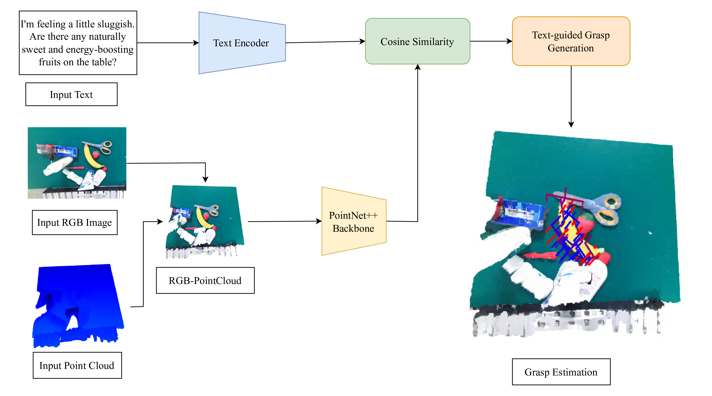

# Robotic Grasp Simulation Based on CoppeliaSim
To verify/test the performance of grasp prediction for text-based objects, we built a generic simulation environment in CoppeliaSim (Vrep) based on a UR3 robot, an RG2 gripper, and an RGB-D camera.
# MODEL Text-Guided-RGBD-grasp-Generation-simulation
[[paper](https://drive.google.com/file/d/1Y7muh4Q74-IHvj3ZB42fAkvdi6XuVkkY/view?usp=sharing)]
[[dataset_visual](https://graspnet.net/)]
[[dataset_text](https://drive.google.com/file/d/1AtoURfvkvyOg2I3drIEPsFYUtH7mKCTc/view?usp=sharing)]
[[checkpoint](https://drive.google.com/file/d/1b5FvUwmf0jSIES24GdNNJbQbPRUtpRH6/view?usp=sharing)]



## Results


## Requirements
- Python 3
- PyTorch 2.3.0
- Open3d >=0.8
- TensorBoard 2.3
- NumPy == 1.24.4
- SciPy
- Pillow
- tqdm

## Installation
Get the code.
```bash
git clone https://github.com/Thiep1808/Text-Guided-RGBD-grasp-Generation-simulation.git
cd Text-Guided-RGBD-grasp-Generation-simulation
```
Install packages via Pip.
```bash
pip install -r requirements.txt
```
Compile and install pointnet2 operators (code adapted from [votenet](https://github.com/facebookresearch/votenet)).
```bash
cd pointnet2
python setup.py install
```
Compile and install knn operator (code adapted from [pytorch_knn_cuda](https://github.com/chrischoy/pytorch_knn_cuda)).
```bash
cd knn
python setup.py install
```
Install graspnetAPI for evaluation.
```bash

cd graspnetAPI
pip install .
```
## Requirements  
A python interpreter, PyTorch, CoppeliaSim (Vrep).  

To use the remote API functionality of Legacy Client in your Python script, you will need following 3 items:  
- sim.py  
- simConst.py  
- remoteApi.dll, remoteApi.dylib or remoteApi.so (depending on your target platform)  

Above files are located in CoppeliaSim's installation directory, under programming/remoteApiBindings/python. 

To connect coppeliasim with ROS
- libsimExtROSInterface.so   in CoppeliaSim_root
- libv_repExtRosInterface.so   copy it into each of the worker directories from the utils directory
## Instructions  
Object models come from YCB model and object set - http://www.ycbbenchmarks.com/object-models/   

0. Install all the dependencies under requirements.txt to anaconda (recommended, system python environment or other virtual python environment is fine)   
1. Open CoppeliaSim and any python interpreter under anaconda  
2. import the scene file RoboticGraspingWIthUR3_v4.ttt into CoppeliaSim  
3. Type simRemoteApi.start(19999) in the Lua command line at the bottom of the CoppeliaSim page to start the Legacy server  
4. Execute the file remote_simulation.py in python interpreter to detect the capture position, angle, etc. and instruct the server side to capture.  

P.S.  
remote_simulation.py loads the trained GR-convNet model to detect the grasping position and pass the relevant information to the server side to guide the grasping;  
RoboticGraspingWIthUR3_v4.ttt internal UR3 child script implements the control and grasping of the robotic arm  
